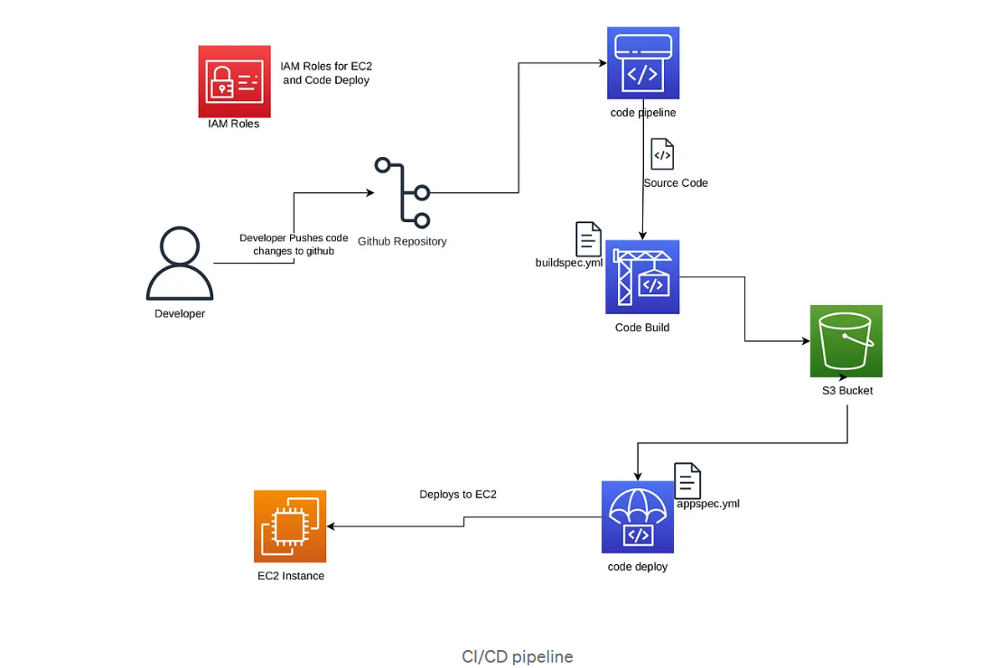

## ReactJS CI/CD CodePipeline with AWS



**Project Description:**

This project is designed to showcase the power of CI/CD pipelines in streamlining and automating the deployment process for modern applications. The goal is to create an efficient, automated pipeline for deploying a ReactJS application to AWS using CodePipeline, CodeBuild, and CodeDeploy. 

As an aspiring DevOps engineer, I recognized the challenges of manual deployments, where the process can become time-consuming, error-prone, and inefficient. By implementing a CI/CD pipeline, I sought to eliminate these issues and provide a seamless deployment workflow that improves code quality, reduces deployment time, and ensures continuous integration and delivery of updates. 

**Introduction:**

CI/CD (Continuous Integration and Continuous Deployment) is a core principle of modern DevOps practices. It automates the steps involved in developing, testing, and deploying software, ensuring code changes are delivered to production quickly, reliably, and with high quality. The CI/CD pipeline is the backbone of efficient software development, enabling teams to push updates frequently while minimizing risks of human error.

**Steps to Create a CI/CD Pipeline:**

1. **Choose a Project to Deploy**: Select a project, such as a ReactJS app, that will be deployed via the CI/CD pipeline.
2. **Set Up IAM Roles**: Create IAM roles for EC2 and CodeDeploy, ensuring they have the necessary permissions.
3. **Create an EC2 Instance**: Set up an EC2 instance with the appropriate IAM role, user configurations, and CodeDeploy agent installation.
4. **Create AWS CodePipeline**: Define the automated pipeline using AWS CodePipeline to automate the flow from code commit to production.
5. **Set Up AWS CodeBuild**: Configure CodeBuild to compile and test the code.
6. **Set Up AWS CodeDeploy**: Use CodeDeploy to automatically deploy the changes to the target EC2 instance.

**GitHub Project:**

For this project, I selected a ReactJS-based frontend application. Understanding the unique aspects of the framework is crucial for ensuring the CI/CD pipeline works efficiently with React. ReactJS, being a frontend framework, requires distinct deployment steps compared to backend frameworks like Django or SpringBoot, as its deployment focuses primarily on the build and static assets.

To begin testing and validating this CI/CD pipeline, the GitHub repository for the ReactJS project can be cloned and modified. The project is hosted here:

[GitHub - react-bookapp-aws-codepipeline](https://github.com/Gaurav1517/react-bookapp-aws-codepipeline.git)

You can clone the project using the following command:

```bash
git clone https://github.com/Gaurav1517/react-bookapp-aws-codepipeline.git
```

Once cloned, you can edit the project as needed and push your changes to GitHub, where the CI/CD pipeline will automatically trigger, testing and deploying the updates to the application. This approach ensures that each change is validated and deployed seamlessly, providing a robust and continuous delivery process.

## IAM role creation, EC2 instance creation, attachment of the IAM role, and installation of the CodeDeploy agent using **UserData**:

---

### **Step 1: Create IAM Roles**

#### **Create IAM Role for EC2 (with `S3FullAccess` and `AWSCodeDeployFullAccess` permissions)**

1. **Sign in to the AWS Management Console**:
   - Go to the [IAM Console](https://console.aws.amazon.com/iam/).
   - In the navigation pane, choose **Roles**.

2. **Create a New Role**:
   - Click the **Create role** button.
   - Choose the **AWS service** role type, then select **EC2** as the use case.

3. **Attach Policies**:
   - Under the **Attach permissions policies** section, search for and select the following policies:
     - **AmazonS3FullAccess**: This policy grants full access to S3 buckets.
     - **AWSCodeDeployFullAccess**: This policy grants full access to AWS CodeDeploy.

4. **Set Role Name**:
   - Enter a name for the role, for example: `EC2-S3-CodeDeploy-Role`.

5. **Review and Create**:
   - Review the role settings.
   - Click **Create role** to create the IAM role.

---

#### **Create IAM Role for CodeDeploy (with `AWSCodeDeployFullAccess` permission)**

1. **Go to the IAM Console**:
   - In the navigation pane, choose **Roles**.

2. **Create a New Role**:
   - Click the **Create role** button.
   - Choose the **AWS service** role type, then select **CodeDeploy** as the use case.

3. **Attach the `AWSCodeDeployFullAccess` Policy**:
   - Under the **Attach permissions policies** section, search for and select the policy:
     - **AWSCodeDeployFullAccess**: This policy grants full access to AWS CodeDeploy.

4. **Set Role Name**:
   - Enter a name for the role, for example: `CodeDeploy-Role`.

5. **Review and Create**:
   - Review the role settings.
   - Click **Create role** to create the IAM role.

---

### **Step 2: Create EC2 Instance and Attach IAM Role**

1. **Sign in to the AWS Management Console**:
   - Go to the [EC2 Dashboard](https://console.aws.amazon.com/ec2/).

2. **Launch a New EC2 Instance**:
   - Click on **Launch Instance** to create a new EC2 instance.

3. **Choose an Amazon Machine Image (AMI)**:
   - Select an **Amazon Linux 2** or another AMI that suits your needs (e.g., Ubuntu, etc.).

4. **Choose an Instance Type**:
   - Select the instance type that fits your requirements (e.g., `t2.micro` for testing purposes).
   - Click **Next: Configure Instance Details**.

5. **Configure Instance**:
   - In the **IAM role** dropdown, select the IAM role you created earlier (e.g., `EC2-S3-CodeDeploy-Role`).
   - Ensure the other settings are configured as per your requirements (e.g., VPC, subnet, and network settings).

6. **Add Storage**:
   - You can use the default settings for storage or modify it based on your requirements (e.g., changing the volume size or type).
   - Click **Next: Add Tags**.

7. **Add Tags (Optional)**:
   - You can optionally add tags (e.g., `Name: MyEC2Instance`) to help identify the instance.
   - Click **Next: Configure Security Group**.

8. **Configure Security Group**:
   - Either select an existing security group or create a new one.
   - Ensure that the necessary ports are open (e.g., port 22 for SSH access, port 80 for HTTP, port 443 for HTTPS).
   - Click **Review and Launch**.

9. **Review and Launch**:
   - Review your instance settings and ensure everything looks correct.
   - Click **Launch**.

10. **Choose a Key Pair**:
    - If you don't have a key pair, create a new one, download it, and keep it secure. If you already have one, select it.
    - Click **Launch Instances**.

---

### **Step 3: Install CodeDeploy Agent using UserData **

You can automate the installation of the CodeDeploy agent during EC2 instance creation by using **UserData**.

1. **Modify Instance Configuration with UserData**:
   - During the EC2 instance creation process, when you reach the **Configure Instance Details** step, scroll down to the **Advanced Details** section.
   - In the **User data** field, add the following script to automatically install and start the CodeDeploy agent:

Ref: https://docs.aws.amazon.com/codedeploy/latest/userguide/codedeploy-agent-operations-install-cli.html

```bash
#!/bin/bash
# Update the instance
sudo apt update -y 
# Install required dependencies
sudo yum install ruby -y
sudo yum install wget -y 
# Download the latest CodeDeploy agent
cd /home/ec2-user
wget https://aws-codedeploy-us-east-2.s3.us-east-2.amazonaws.com/latest/install
# Set execute permissions on the install file:
chmod +x ./install
# To install the latest version of the CodeDeploy agent:
sudo ./install auto
# tart the service and run the following two commands, one at a time:
systemctl start codedeploy-agent
systemctl enable codedeploy-agent
systemctl status codedeploy-agent
```

   - **Note**: Replace `<version>` with the latest version of the CodeDeploy agent available. You can find the correct version by visiting the [AWS CodeDeploy GitHub repository](https://github.com/aws/aws-codedeploy-agent).

2. **Launch the EC2 Instance**:
   - After adding the UserData script, complete the EC2 instance creation process by clicking **Launch Instances**.

The EC2 instance will now automatically install the CodeDeploy agent and start it on boot without needing SSH access.

---

### **Step 4: Verify EC2 Instance and IAM Role Permissions**

1. **Verify the EC2 Instance**:
   - Ensure that the EC2 instance is running and that the IAM role is properly attached.

2. **Verify the CodeDeploy Agent**:
   - The CodeDeploy agent should have started automatically on the EC2 instance as part of the UserData script. You can verify this in the EC2 instance's **System Log**.

3. **Test CodeDeploy Setup**:
   - To ensure that everything is configured correctly, you can initiate a deployment from AWS CodeDeploy to your EC2 instance and verify that it is successfully deployed.

---

### **Step 5: Verify Permissions**

- **EC2 Role**: Ensure the EC2 instance has the necessary permissions to access S3 and interact with CodeDeploy.
  - The `EC2-S3-CodeDeploy-Role` role should include `AmazonS3FullAccess` and `AWSCodeDeployFullAccess` permissions.
  
- **CodeDeploy Role**: Verify that the CodeDeploy role has sufficient permissions to interact with EC2 instances and deploy the application.
